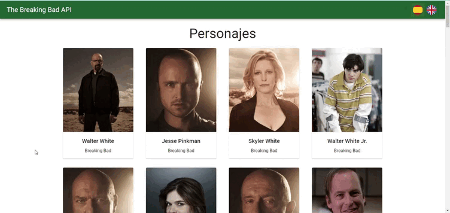

# THE BREAKING BAD API

### Indice

- [Descripción](#descripción)
- [Arracar el proyecto](#arrancar-proyecto)
- [Test](#test)
- [Configuración inicial](#configuración-inicial)
- [Estilos](#estilos)
- [Rutas](#router)
- [Estructuras y componentes](#estructura-y-componentes)
- [Control del estado y API](#control-del-estado-y-llamadas-a-la-api)

### Descripción

Proyecto realizado usando [The Breaking Bad API](https://breakingbadapi.com/). La página muestra todos los personajes, con la opción de navegar a cada uno de ellos y mostrar toda la información relacionada con los mismos. También incorpora la opción para poder alternar de idioma entre español e inglés.

### Arrancar proyecto

1 - Clonar el proyecto
2 - Entra a la carpeta breaking-bad-api
3 - Instala las dependencias `npm install`
4 - Ejecuta el proyecto en local `npm run start`

### Test

Para ejecutar el testing, correr el comando `npm run cypress`. Si se quiere ejecutar los tests en consola, el script es `npm run cypress:test.`

### Configuración inicial

Con el fin de mejorar la calidad del código, seguir ciertas reglas y mantener una coherencia, he instalado algunas dependencias como:

- Eslint
- Prettier
- Husky

### Estilos

Aunque mi idea inicial fue usar SCSS (y así fue como empecé), al final opté por cambiar y usar JSS con `useStyles` de la librería de `@mui/styles` y aprovechar las funcionalidad que esta librería ofrece. Para darle algo de animación, he usado la librería framer motion. El proyecto es completamente **responsive**.

### Estructura y componentes

El proyecto se ha creado aplicando **principios SOLID**.
A la hora de estructurar el proyecto y sus componentes, he decidio hacerlo en tres carpetas principales.

- `layout`: van los componentes principales y los que van a dar la estructura al proyecto, ya que se van a usar en cada una de las páginas.
- `pages`: guarda cada una de las páginas qué, como ya se ha dicho con anterioridad, van a ir enlazadas a una ruta distinta (en el siguiente apartado se especifican cada una de ellas).
- `components`: he guardado cada uno de los componentes que se ha usado en la aplicación.

Además de esta estructura básica, el proyecto lo he dividido en otras carpetas:
- `assets`: se encuentran todos los archivos de imágenes.
- `features`: guarda todo lo relacionada con redux. Esta carpeta se completa con el archivo `store.js`. La estructura es la recomendada por [la documentación oficial de redux-toolkit](https://redux.js.org/faq/code-structure)
- `helpers`: guarda todas las funciones útiles y reutilizables del proyecto En este caso guarda una única función para sacar la edad (dependiendo de la fecha de nacimiento).
- `hooks`: guarda los custom hooks.
- `service`: contiene la información relativa a la API.
- `theme`: contiene la configuración de los estilos. Como ya he dicho, se ha usado las funcionalidad de material-ui para esto.
- `translation`: guarda las traducciones de la página que se van a mostrar gracias a la dependencia i18next instalada.

## Rutas

Para el router he usado la librería de [react-router-dom v6](https://reactrouter.com/docs/en/v6/getting-started/overview). El proyecto cuenta con tres rutas:

- La página principal, que contiene todos los personajes.
- La página en detalla de cada personaje, en la cual la el valor del parámetro de la url dependerá del nombre del personaje.
- Una página de error en el caso de que algo falle o se navegue a alguna página que no existe en el router configurado.

### Control del estado y llamadas a la API

Para controlar el estado de la aplicación y traer la información he usado dos métodos diferentes:

- **Redux toolkit**: lo he usado para hacer la petición a la API y traer todos los personajes a la página principal. Haciendo uso de los extraReducers que trae el `createSlice`, es muy fácil controlar el estado de la aplicación y así mostrar la información correspondiente dependiendo del estado de la petición (pending, rejected, fullfilled). El fetch lo he colocado en `App.js`, en el nivel más alto de la aplicación. Como la lista de personajes es algo que no va a cambiar y, por lo tanto, solo vamos a necesitar hacer la petición a la API una vez, colocándola ahí va a evitar hacer llamadas innecesarias a la misma.
- **SWR / Suspense**: tanto para obtención de la información de detalle del personaje, como para traer la frase random, he usado la biblioteca de `SWR`, ya que creo que simplifica mucho a la hora de hacer las peticiones. He aprovechado y he creado un custom Hook para facilitar, todavía más, la petición. Además, aprovechando las nuevas características del componente `Suspense` que se han implantado con React 18, he usado el mismo para envolver ambos componentes. Ya que ahora este permite hacer renderizados en el lado del servidor y puesto que he metido ambos componenentes dentro del mismo suspense, se mostrará el fallback hasta que ambas peticiones se hayan completado. Para manejar el error, he usado la librería react-error-suspense con el componente ErrorBoundary de la misma.
